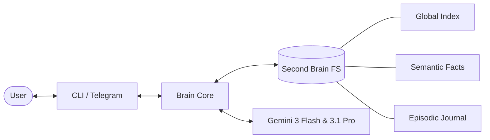

# OpenBrain 🧠 — Your Personal Agentic Second Brain

[](https://opensource.org/licenses/MIT)
[](https://www.python.org/downloads/)
[]()

> **OpenBrain** is a high-fidelity, modular agentic ecosystem designed to manage your life history, academic goals, and professional aspirations through a locally-hosted "Second Brain" interface. Powered by **Gemini 3 Flash & 3.1 Pro**, it bridges the gap between static notes and proactive digital assistance.

---

## 🌟 Key Features

*   **Modular Semantic Memory**: A hierarchical knowledge base built on human-readable Markdown. Optimized for high-recall RAG without the overhead of heavy vector databases.
*   **macOS Deep Integration**: Real-time synchronization with **Apple Reminders**, system monitoring, and terminal automation.
*   **Multi-Interface Orchestration**: Use it via a high-performance **CLI (Terminal)** or a proactive, mobile-ready **Telegram Bot**.
*   **Proactive Reflection**: The agent autonomously analyzes your goals (e.g., UTBM CC3 schedules, Quant Finance research) and chooses the right moment to intervene and support you.
*   **Rolling-Window Context**: Intelligent conversation summarization ensures it never forgets your long-term facts while staying lean on token costs.

---

## 🏗️ System Architecture

OpenBrain follows a **memory-centric** architectural pattern, separating logic from state.



> [!NOTE]
> For a deep dive into the underlying data flow and memory stratification, see [docs/ARCHITECTURE.md](docs/ARCHITECTURE.md).

---

## 🛠️ Getting Started (Zero-Friction Install)

### 1. Prerequisites
*   macOS (for Apple Reminders sync)
*   Python 3.10+
*   [gemini-cli](https://github.com/google-gemini/gemini-cli) installed and configured on your system.

### 2. Quick Install
```bash
git clone https://github.com/gauthierstrich/OpenBrain.git
cd OpenBrain
./scripts/setup.sh
```

### 3. Environment Configuration
Copy the `.env.example` to `.env` and fill in your credentials:
```bash
# Telegram Bot Token from @BotFather
TELEGRAM_BOT_TOKEN=8739138090:your_token
# Your numeric Telegram ID
ALLOWED_USER_ID=2003436311
# The local path where your Second Brain lives
BRAIN_STORAGE_PATH=~/Documents/Second Brain/OpenBrain
```

### 4. Launching the Brain
```bash
# Terminal Mode (CLI)
python3 src/main_cli.py

# Telegram Mode (Proactive Bot)
python3 src/main_telegram.py
```

---

## 📖 Philosophical Core

OpenBrain is not a toy; it is an extension of your cognitive capacity. It adheres to three strict rules:
1.  **Privacy First**: Your memory lives on your machine, not in a cloud database.
2.  **Human Clarity**: All memory is stored in Markdown, readable by you at any time.
3.  **Strategic Support**: The agent focuses on your higher-level goals (Academic Excellence, Quant Fund Management) over trivial tasks.

---

## 🤝 Contributing & License

We value high-quality contributions. Please read [CONTRIBUTING.md](CONTRIBUTING.md) before opening a PR.

Distributed under the **MIT License**. See `LICENSE` for more information.

---
*Created by **Gauthier Strich** — UTBM TC4 Student & Quantitative Research Enthusiast.*
