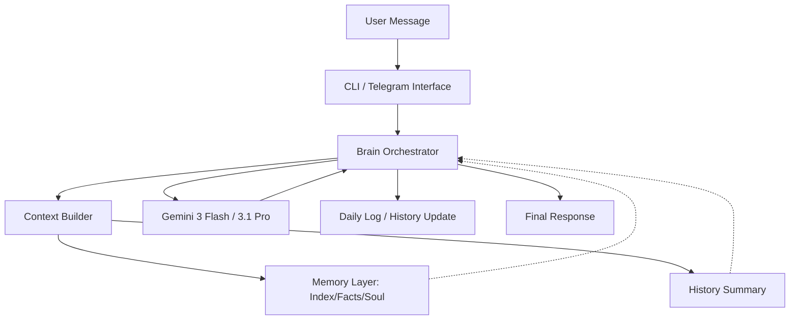

# OpenBrain Architecture Design 🧠

OpenBrain is an agentic framework designed to serve as a **Modular Second Brain**. Unlike traditional chatbots, it leverages a hierarchical memory system and local system access to provide proactive, context-aware assistance.

---

## 🏗️ System Overview

The system is built on a split-architecture model:
1.  **The Logic Layer (Python Core)**: Handles orchestration, state management, and LLM interfacing.
2.  **The Memory Layer (Markdown Storage)**: A human-readable, Git-versioned knowledge base structured for high-recall RAG (Retrieval-Augmented Generation).

### High-Level Data Flow

---

## 🧠 Memory Stratification

OpenBrain utilizes a **three-tier memory architecture** to minimize token latency while maximizing long-term recall.

### 1. The Global Index (`index.md`)
The entry point of all knowledge. It acts as a semantic map, providing the agent with relative paths to specialized modules. This allows the agent to navigate the file system only when specific details are required.

### 2. Semantic Memory (`Souvenirs/Faits/`)
The "Long-term" storage. Context is modularized into thematic Markdown files:
*   **Identity**: `personne.md`, `user.md`, `soul.md`.
*   **Knowledge**: `etudes_utbm.md`, `projets_finance.md`.
*   **Logistics**: `routine_logistique.md`, `agenda_devoirs.md`.

### 3. Episodic Memory (`Souvenirs/Journal/`)
Captures the "Timeline". Every interaction is logged in daily files (`YYYY-MM-DD.md`), allowing the agent to reconstruct historical context and track progress over time.

---

## 📉 Content Compression & Optimization

### Rolling Window Summarization
To maintain high performance over long conversations, OpenBrain implements an automatic summarization trigger:
-   **Threshold**: When history exceeds 20 turns.
-   **Method**: The oldest 5 turns are fused into a `history_summary.txt` via a specialized "Summarizer" prompt.
-   **Result**: The context window stays lean, focusing on the latest 15 turns + a recursive global summary.

---

## 🛡️ Security & Execution Bounds

### The YOLO Flag (`-y`)
OpenBrain utilizes `gemini-cli` in non-interactive mode. This grants the agent the ability to:
-   **Autonomously Read/Write**: Manage its own memory structure.
-   **System Diagnostics**: Execute local shell commands for file organization, compilation, or system monitoring.
-   **Isolation**: The execution is bounded to the `BRAIN_STORAGE_PATH` defined in `.env`.

---
*Document Version: 1.5.0*
*Standard: Google Engineering Documentation*
