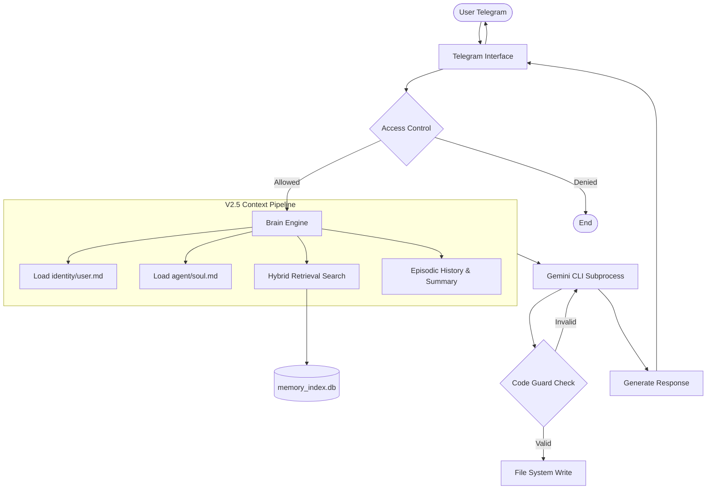

# Architecture Reference (V2.5 — Cognitive OS)

This document describes the technical architecture of OpenBrain V2.5. It is intended for developers, contributors, and users who want to understand how the system manages memory, identity, and inference.

---

## 1. System Overview

OpenBrain is a **multi-process supervisor** managing one or more independent agent processes. Each agent process handles a Telegram interface backed by the **Brain Engine** instance.

### Key Architectural Tenets:
- **Filesystem as State**: No external database. All state is stored in Markdown files.
- **Stateless Computation**: Process-level state is minimized to ensure resilience and recovery.
- **Native Tooling**: Agents leverage Gemini CLI's native system access (YOLO mode) to interact with the OS.

---

## 2. Component Reference

### Brain Engine (`brain.py`)
The central orchestrator responsible for:
1. **Context Construction**: Concatenating Global Identity, Agent-specific Soul, User Preferences, Hybrid Search results, and recent History.
2. **Hybrid Search Trigger**: Invoking `MemoryIndex` to find relevant facts based on user input.
3. **LLM Invocation**: Calling Gemini CLI via `subprocess.run()` with context passed via `stdin`.
4. **Memory Flush**: A self-preservation cycle that instructs the agent to save critical facts before conversation compaction occurs.

### Memory Index (`memory_index.py`)
A hybrid retrieval engine using:
- **SQLite FTS5 (Lexical)**: Keyword matching using BM25 ranking.
- **Gemini Embeddings (Semantic)**: Vector search using `text-embedding-004`.
- **OAuth Bridge**: Bridges directly to the Gemini CLI's session tokens to avoid manual API key management.

### Agent Loader (`agent_loader.py`)
Scans the `agents/` directory and manages automatic migration and repair. Version 2.5 ensures all agents follow the Obsidian-Ready directory structure.

### Code Guard (`code_guard.py`)
A safety layer that intercepts file-write operations. It compiles and validates Python syntax before allowing an agent to modify critical system files, preventing "hallucination-induced" crashes.

---

## 3. Data Flow Diagram (Message Processing)



---

## 4. Memory Architecture (Obsidian V2.5)

The memory structure is optimized for **Obsidian compatibility**, allowing for a "human-in-the-loop" experience where you can browse and edit your agent's mind manually.

### Directory Layout
```
agents/<agent-name>/
├── 📓 01 - Journal/          # Daily episodic logs (Callouts + YAML)
├── 🧠 02 - Mémoire/          # Durable long-term knowledge (Wikilinks)
├── ⚙️ 03 - Configuration/    # System instructions (soul, user, index)
└── 04 - Archives/            # Rolling history and SQLite index
```

### Self-Preservation (The Flush Cycle)
When the conversation reaches the **Token Budget (~8000 tokens)**, the Brain Engine triggers a silent **Flush Turn**:
1. The agent is prompted to identify any "Durable Facts" in the recent history.
2. The agent writes these facts to `02 - Mémoire/`.
3. Only then is the oldest part of the history summarized and moved to `history_summary.txt`.

---

## 5. Security Model

| Surface | Risk | Mitigation |
|---------|------|------------|
| Telegram | Unauthorized Access | Strict `ALLOWED_USER_ID` check on every message. |
| Filesystem | Malicious Writing | `Code Guard` validates syntax; OS-level user permissions. |
| Credentials | Secret Leak | `.env` ignored by Git; OAuth tokens stored in `~/.gemini/`. |

---
*OpenBrain Core V2.5 — Engineering for Autonomy, Sovereignty, and Intelligence.*
